# Support Ticket Triage Agent

An AI agent that triages multi-turn customer support tickets. It classifies urgency, extracts product, issue type and sentiment, checks a knowledge base and internal systems with tools, decides the next action, and drafts a reply in the customer's language.

Built with **LangGraph**, **OpenAI GPT**, **Pydantic v2**, **FastAPI** and **Rich**.

---

## Quickstart

Requires Python 3.11+ and an OpenAI API key.

```bash
git clone <repo-url>
cd OOCA_AI-Engineer_assignment

python -m venv .venv
source .venv/bin/activate          # Windows: .\.venv\Scripts\Activate.ps1
pip install -r requirements.txt

cp .env.example .env               # Windows: copy .env.example .env
# then set OPENAI_API_KEY in .env

python main.py --all               # triage all 3 sample tickets
```

`.env` settings:

| Variable               | Default         | Purpose                                                        |
| ---------------------- | --------------- | -------------------------------------------------------------- |
| `OPENAI_API_KEY`     | —              | Required. Used for the agent and the knowledge-base embeddings |
| `OPENAI_MODEL_NAME`  | `gpt-4o-mini` | Chat model                                                     |
| `OPENAI_TEMPERATURE` | `0.0`         | Sampling temperature                                           |
| `MAX_TOOL_CALLS`     | `3`           | Tool-call budget per ticket                                    |

---

## How it works



The agent is a bounded ReAct loop in LangGraph ([src/graph/workflow.py](src/graph/workflow.py)):

1. **`prepare_context`** masks PII (card numbers, CVVs, emails) and detects Thai or English.
2. **`call_agent`** lets the LLM read the thread and request tools.
3. **`exec_tools`** runs the requested tools and loops back, until the LLM stops asking or the budget of `MAX_TOOL_CALLS` is spent.
4. **`finalize_triage`** produces a structured `TriageDecision` from a clean summary of the tool findings, then applies response guardrails and writes an audit log entry.

**Output** (`TriageDecision`, [src/models/triage.py](src/models/triage.py)): `urgency` (critical/high/medium/low), `product`, `issue_type`, `customer_sentiment`, `next_action` (`auto-respond` / `route_to_specialist` / `escalate_to_human`), `routing_target`, `reasoning`, `draft_response`.

**System prompt:** [src/prompts/system_prompt.py](src/prompts/system_prompt.py) (agent) and [src/prompts/extraction_prompt.py](src/prompts/extraction_prompt.py) (final decision).

### Tools

All tools return mocked data. The knowledge base searches sample markdown documents written for this challenge in [data/kb/](data/kb/).

| Tool                      | Purpose                                                                                            |
| ------------------------- | -------------------------------------------------------------------------------------------------- |
| `lookup_knowledge_base` | Hybrid search (BM25 + OpenAI embeddings, merged with RRF) over policies, runbooks and known issues |
| `check_system_status`   | Regional health and error rates, independent of the public status page                             |
| `check_billing_records` | Payment attempts, pending authorization holds vs settled charges                                   |
| `check_ticket_history`  | Customer history, plan and SLA commitments                                                         |

To add a tool, write it in `src/tools/` and register it in [src/tools/base.py](src/tools/base.py).

### Guardrails

- **PII masking** before any text reaches the LLM.
- **No financial promises:** the agent never promises refunds or reversals; disputed charges go to Billing Operations.
- **Customer reports beat the status page:** widespread errors escalate even if the status page says "operational".
- **Language mirroring:** Thai tickets get polite Thai replies; English tickets get English.
- **Chat formatting:** no email artifacts (`Subject:`, `Dear…`, sign-offs).
- **Fixed escalation reply** for `escalate_to_human`, and a safe fallback decision if structured output fails.
- **Audit log:** every decision and tool call is written to `logs/triage_audit.jsonl`.

---

## Sample tickets

Defined in [data/sample_tickets.json](data/sample_tickets.json).

| # | Scenario                                                                                  | Run                           |
| - | ----------------------------------------------------------------------------------------- | ----------------------------- |
| 1 | Free user, three $29.99 charges after a failed Pro upgrade, threatening a chargeback      | `python main.py --ticket 1` |
| 2 | Thai Enterprise customer, HTTP 500 across browsers while the status page says operational | `python main.py --ticket 2` |
| 3 | Pro user asking about dark mode, a macOS theme sync bug and a scheduling feature request  | `python main.py --ticket 3` |

Add `--json` for machine-readable output, e.g. `python main.py --all --json`.

---

## Running as an API

```bash
python main.py --serve --port 8000
```

Interactive docs at [http://127.0.0.1:8000/docs](http://127.0.0.1:8000/docs).

| Method   | Endpoint                           | Purpose                                                              |
| -------- | ---------------------------------- | -------------------------------------------------------------------- |
| `POST` | `/api/v1/triage`                 | Triage a stored ticket by`ticket_id`                               |
| `POST` | `/api/v1/triage/realtime`        | Triage a new live message, optionally appended to an existing ticket |
| `GET`  | `/api/v1/audit/logs/{ticket_id}` | Audit trail for one ticket                                           |
| `GET`  | `/health`                        | Health, registered tools and model config                            |

```bash
curl -X POST http://127.0.0.1:8000/api/v1/triage \
  -H "Content-Type: application/json" \
  -d '{"ticket_id": "TICKET-001"}'
```

### Docker

```bash
docker compose up --build -d          # API on port 8000
docker compose run --rm triage-cli    # run the sample tickets in a container
docker compose down
```

---

## Tests

```bash
pytest tests/ -v
```

Covers the tools, PII masking and guardrails, the audit logger, API contracts, and graph routing.

---

## Project structure

```text
├── main.py              # CLI runner and API launcher
├── data/                # Sample tickets and knowledge-base markdown
├── src/
│   ├── graph/           # LangGraph nodes, routing and workflow
│   ├── prompts/         # Agent and extraction prompts
│   ├── tools/           # Tool definitions and registry
│   ├── models/          # Ticket and TriageDecision schemas
│   ├── api/             # FastAPI app and request/response schemas
│   ├── utils/           # PII masking, response templates, audit log, terminal UI
│   ├── config.py        # Settings from .env
│   └── state.py         # Graph state
├── tests/
└── docs/                # Requirements, design notes, edge cases, diagram source
```
