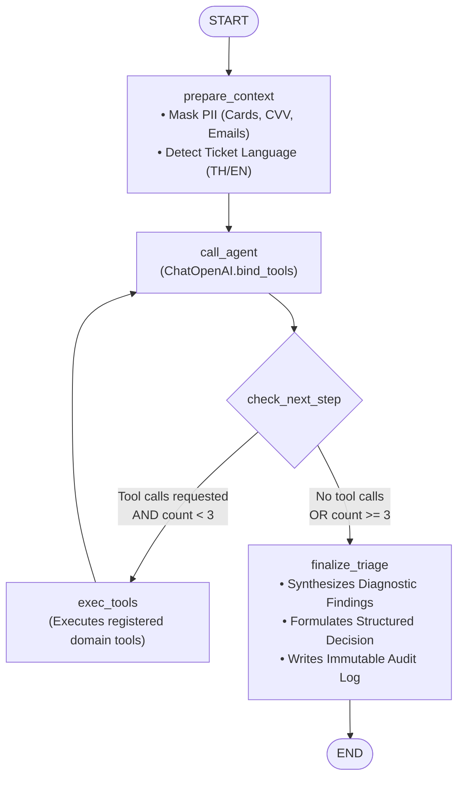

# Support Ticket Triage Agent (OOCA AI Engineer Test)

An autonomous AI agent designed to triage inbound multi-turn customer support tickets, classify urgency, retrieve internal documentation/system telemetry, and determine operational routing actions using **LangGraph**, **OpenAI GPT**, **Pydantic v2**, **FastAPI**, and **Rich**.

---

## 1. Project Overview

### Core Mission
Customer support teams at scale face high ticket volumes, ranging from routine inquiries to critical infrastructure outages and high-risk billing disputes. This system acts as an autonomous first-responder that:
1. **Classifies Urgency:** Prioritizes tickets into discrete urgency levels (`critical`, `high`, `medium`, `low`) based on customer sentiment escalation and contract SLA commitments.
2. **Extracts Domain Metadata:** Identifies specific products/features, categorizes issue types (`billing_payment`, `system_outage`, `bug_report`, `feature_request`), and maps emotional sentiment.
3. **Executes Autonomous Fact-Checking:** Performs multi-source tool lookups against internal knowledge bases, payment gateway ledgers, CRM contracts, and live infrastructure telemetry.
4. **Determines Operational Next Actions:**
   * `auto-respond`: Directly resolves verified issues using official policy runbooks.
   * `route_to_specialist`: Directs complex disputes to dedicated teams (e.g., Billing Operations) with structured context.
   * `escalate_to_human`: Immediately triggers emergency protocols for high-stakes incidents (e.g., DevOps Incident Commanders).
5. **Generates Grounded Customer Responses:** Formulates context-aware in-ticket responses strictly adhering to company compliance policies and language mirroring.

### Benchmark Scenarios Covered
The repository is evaluated against three real-world multi-turn support threads:
* **Scenario 1 (Billing Dispute):** Free user attempted Pro upgrade; experienced three $29.99 pending charges; facing a presentation deadline with chargeback threats.
* **Scenario 2 (Enterprise Outage):** Thailand Enterprise customer (45 seats, 15-min SLA) experiencing HTTP 500 errors across multiple browsers while public status page reports "Operational".
* **Scenario 3 (macOS Dark Mode Feature & Bug):** Pro user inquiring about dark mode scheduling, encountering known theme synchronization behavior.

---

## 2. System Architecture & Agentic Design

### 2.1 LangGraph Cyclic State Machine
The core reasoning engine is implemented as a bounded cyclic ReAct state machine using **LangGraph**. It decouples iterative exploratory tool calls from final structured extraction:



#### Node Lifecycle & State Isolation:
* **`prepare_context`**: Scrubs PII, determines language (`th` or `en`), and sets up initial prompt history.
* **`call_agent`**: LLM reasons over the chronological thread and requests tools if facts need verification.
* **`exec_tools`**: Executes tools dynamically, records results in state, and increments the safety loop counter.
* **`finalize_triage`**: Calls `.with_structured_output(TriageDecision)` using a decoupled diagnostic summary to ensure zero dangling tool call errors (prevents OpenAI API 400).

---

### 2.2 The 4 Domain Specialized Tools
Following the **Single Responsibility Principle (SRP)**, the agent has access to 4 specialized tools across different operational domains:

| # | Tool Name | Module | Domain & Operational Role |
|---|---|---|---|
| 1 | **`lookup_knowledge_base`** | `src/tools/knowledge_tools.py` | **Hybrid Search Engine (BM25 + OpenAI Embeddings + RRF):** Searches internal markdown policies, refund rules, and known bug workarounds. Deliberate knowledge gaps return empty results for unreleased features. |
| 2 | **`check_system_status`** | `src/tools/system_tools.py` | **Infrastructure Telemetry:** Inspects regional edge clusters and synthetic probe delay (detects Southeast Asia BGP route flap with 16.4% HTTP 500 errors). |
| 3 | **`check_billing_records`** | `src/tools/billing_tools.py` | **Payment Gateway (Stripe) Ledger:** Inspects recent authorization holds vs. settled merchant charges (verifies uncaptured authorization holds). |
| 4 | **`check_ticket_history`** | `src/tools/ticket_tools.py` | **CRM Account History & SLA:** Retrieves past ticket history, churn risk score, and contractual SLA response time guarantees (e.g. 15-minute Sev-1 response). |

---

### 2.3 Production Guardrails & Privacy-by-Design
* **Zero-PII Compliance (PDPA / GDPR):** Deterministic regex scrubbers mask credit card PANs, 3-digit CVVs, and email addresses prior to LLM submission.
* **Zero Financial Promises Rule:** The triage agent is strictly prohibited from promising manual refunds or instant card reversals in draft responses. Authorization holds are explained as temporary bank reserves.
* **Telemetry Discrepancy Override:** Multi-machine customer-reported HTTP 500 errors strictly override lagging public status monitors (15-30m cache lag), triggering immediate Sev-1 human escalation.
* **Strict Language Mirroring:** English tickets strictly receive English responses; Thai tickets receive polite, formal Thai responses (`ครับ/ค่ะ`).
* **Direct In-Ticket Chat Formatting:** Prohibits email artifacts (no `Subject:`, no `Dear...`, no sign-offs like `Best regards`) to match modern in-app chat systems.
* **Tenant-Safe Audit Trail:** Logs every decision, tool call, argument, and output snippet to `logs/triage_audit.jsonl` with strict ticket-scoped retrieval to prevent cross-tenant data leaks.

---

## 3. How to Run (3 Execution Modes)

### Prerequisites & Setup

```powershell
# 1. Clone repository & navigate to root
cd c:\Users\punso\Downloads\OOCA_AI-Eng-test

# 2. Create and activate Python virtual environment (Python 3.11+)
python -m venv .venv
.\.venv\Scripts\Activate.ps1

# 3. Install dependencies
pip install -r requirements.txt

# 4. Configure environment variables
copy .env.example .env
```

Ensure your `.env` contains your OpenAI API key:
```ini
OPENAI_API_KEY=sk-proj-your-api-key-here
OPENAI_MODEL_NAME=gpt-4o-mini
OPENAI_TEMPERATURE=0.0
MAX_TOOL_CALLS=3
```

---

### 💻 Mode 1: Terminal CLI Runner

Run the benchmark evaluation runner formatted with Rich tables and diagnostics:

```powershell
# Run all 3 benchmark scenarios sequentially
python main.py --all

# Run a specific benchmark scenario (1, 2, or 3)
python main.py --ticket 1    # Scenario 1: Billing Dispute & Pending Holds
python main.py --ticket 2    # Scenario 2: Enterprise Outage & Asia Region 500
python main.py --ticket 3    # Scenario 3: macOS Dark Mode Bug & Feature Request

# Output raw machine-readable JSON
python main.py --all --json
```

---

### 🌐 Mode 2: Local Web API (FastAPI + Swagger UI)

Start the production-ready FastAPI backend server:

```powershell
# Launch API server via CLI flag
python main.py --serve --port 8000

# Or run directly via Uvicorn with auto-reload
uvicorn src.api.app:app --host 0.0.0.0 --port 8000 --reload
```

#### Interactive Documentation:
* **Swagger UI:** [http://127.0.0.1:8000/docs](http://127.0.0.1:8000/docs)
* **ReDoc:** [http://127.0.0.1:8000/redoc](http://127.0.0.1:8000/redoc)

#### Core Endpoints:
1. **Triage Stored Ticket by ID (`POST /api/v1/triage`):**  
   Triages an existing ticket stored in the system (e.g. `TICKET-001`, `TICKET-002`, `TICKET-003`).
   ```bash
   curl -X POST "http://127.0.0.1:8000/api/v1/triage" \
     -H "Content-Type: application/json" \
     -d '{"ticket_id": "TICKET-001"}'
   ```

2. **Real-Time Live Chat Triage (`POST /api/v1/triage/realtime`):**  
   Handles real-time customer messages. If `ticket_id` is supplied, it attaches the message to the ongoing thread to preserve conversational context; otherwise, it creates a new ticket.
   ```bash
   curl -X POST "http://127.0.0.1:8000/api/v1/triage/realtime" \
     -H "Content-Type: application/json" \
     -d '{
       "ticket_id": "TICKET-001",
       "message": "Following up on my charges - please check this!"
     }'
   ```

3. **Tenant-Safe Audit Trail (`GET /api/v1/audit/logs/{ticket_id}`):**  
   Retrieves immutable execution traces strictly isolated to the specified ticket ID (protects against IDOR / cross-tenant leaks).
   ```bash
   curl -X GET "http://127.0.0.1:8000/api/v1/audit/logs/TICKET-001"
   ```

4. **Health Check & Readiness Probe (`GET /health`):**  
   Reports service health, registered tools, and model configuration.
   ```bash
   curl -X GET "http://127.0.0.1:8000/health"
   ```

---

### 🐳 Mode 3: Docker & Docker Compose Build

Build and run the containerized service with audit log volume mounting and automated healthchecks:

```powershell
# 1. Build image and launch container in background
docker compose up --build -d

# 2. Verify container health status
docker compose ps

# 3. View live application logs
docker compose logs -f

# 4. (Optional) Run the CLI benchmark tickets inside Docker container
docker compose run --rm triage-cli

# 5. Shut down container
docker compose down
```

---

## 🧪 Running Automated Tests

The test suite covers unit logic, tool execution, PII masking, guardrails, API contracts, and LangGraph compilation:

```powershell
pytest tests/ -v
```

**Status:** 31 passed tests across 5 test suites.

---

## 📂 Repository Structure

```text
OOCA_AI-Eng-test/
├── docs/
│   ├── REQUIREMENTS.md         # Problem specifications & test criteria
│   ├── EDGE_CASE.md            # Production edge cases & architectural nuances
│   ├── SYSTEM_DESIGN.md        # Technical architecture & LangGraph specification
│   └── AGENTIC_DESIGN.md       # Comparative analysis & enterprise scaling roadmap
├── writeup.md                  # 1-Page architecture & evaluation summary
├── README.md                   # Complete system documentation
├── requirements.txt            # Python dependencies
├── Dockerfile                  # Production container definition
├── docker-compose.yml          # Compose specification with volume mounting & healthcheck
├── .env.example                # Environment variables template
├── main.py                     # Rich CLI runner & server launcher
├── data/
│   ├── sample_tickets.json     # 3 Canonical benchmark tickets (12 messages)
│   └── kb/                     # Unstructured markdown runbooks & policies
│       ├── billing_refund_policy.md
│       ├── incident_sev1_runbook.md
│       ├── macos_desktop_known_issues.md
│       └── account_security_faq.md
├── src/
│   ├── api/
│   │   ├── __init__.py         # FastAPI backend package
│   │   ├── app.py              # Endpoints, middleware, and lifecycle handlers
│   │   └── schemas.py          # Request & Response Pydantic DTO contracts
│   ├── config.py               # Pydantic settings & environment configuration
│   ├── state.py                # LangGraph TriageState schema
│   ├── models/
│   │   ├── domain.py           # Inbound ticket & message schemas
│   │   └── triage.py           # TriageDecision & classification enums
│   ├── tools/
│   │   ├── base.py             # Tool bundle registry (get_triage_tools)
│   │   ├── knowledge_tools.py  # Hybrid Search KB engine (BM25 + Embeddings + RRF)
│   │   ├── system_tools.py     # Infrastructure & edge telemetry tool
│   │   ├── billing_tools.py    # Payment gateway ledger & auth-hold inspector
│   │   └── ticket_tools.py     # CRM historical tickets & SLA commitment inspector
│   ├── prompts/
│   │   ├── system_prompt.py    # Master ReAct instructions & operational guardrails
│   │   └── extraction_prompt.py# Structured output synthesis prompt
│   ├── graph/
│   │   ├── nodes.py            # LangGraph node implementations
│   │   ├── edges.py            # Conditional routing logic
│   │   └── workflow.py         # Compiled StateGraph definition
│   └── utils/
│       ├── formatting.py       # Rich terminal UI components
│       ├── audit_logger.py     # Structured audit trail (logs/triage_audit.jsonl)
│       ├── response_templates.py # Guardrailed response templates
│       └── pii_sanitizer.py    # PDPA/GDPR PII masking utility
└── tests/
    ├── test_api.py             # FastAPI integration & contract validation tests
    ├── test_audit_logger.py    # Structured audit logging unit tests
    ├── test_tools.py           # KB lookup, telemetry & domain tools unit tests
    ├── test_guardrails.py      # PII scrubbing & financial promise policy tests
    └── test_triage.py          # State machine transitions & compilation tests
```
