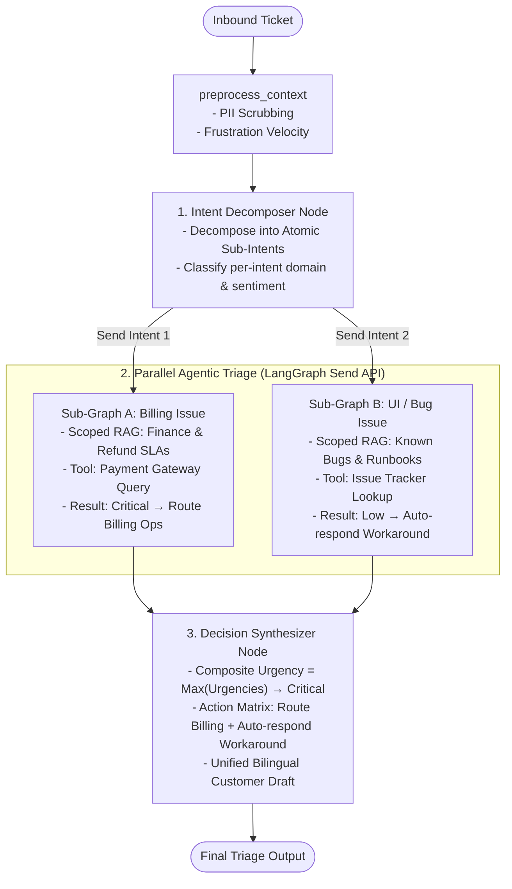
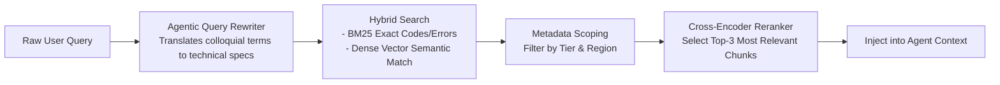

# Agentic Architecture & Enterprise Scaling Design

**Target Project:** Support Ticket Triage Agent (OOCA Engineering)
**Document:** `docs/AGENTIC_DESIGN.md`
**Purpose:** Comparative analysis of agentic design patterns, trade-offs, and an enterprise scaling roadmap addressing **Massive Knowledge Bases** and **Multi-Intent / Sub-Query Support Tickets**.

---

## 1. Agentic Architectural Patterns Comparison

We evaluated three primary design patterns for orchestrating the Support Ticket Triage Agent:

| Pattern                                               | Execution Flow                                                                             | Strengths                                                                          | Trade-offs                                                                    |
| :---------------------------------------------------- | :----------------------------------------------------------------------------------------- | :--------------------------------------------------------------------------------- | :---------------------------------------------------------------------------- |
| **1. Single ReAct Loop (Baseline)**                   | `call_agent` (bind_tools) $\leftrightarrow$ `exec_tools` $\rightarrow$ `finalize_triage`   | - Clean, readable codebase<br>- Low latency (~2-3 LLM calls)<br>- Easy to debug and trace  | System prompt must encapsulate both tool-calling strategy and triage policies |
| **2. Two-Stage (Investigator $\rightarrow$ Decider)** | Stage 1: Fact Retrieval $\rightarrow$ Stage 2: SLA & Action Decision                       | - Strict Separation of Concerns (SoC)<br>- Prevents action hallucination during search     | - Higher latency (~4-5 LLM calls)<br>- State schema overhead                  |
| **3. Multi-Agent Supervisor**                         | Supervisor routes to Billing, DevOps, and Bug specialist agents                            | - Modular domain isolation<br>- Independent scaling per team                       | - High token overhead<br>- Unnecessary latency<br>- Over-engineering for 3 scenarios  |

> **Decision Rationale:** For this assignment, **Single ReAct + Strict Finalizer (Pattern 1)** best satisfies the evaluation criteria (**Readability, Maintainability, Extensibility, and Logic**) without premature over-engineering.

---

## 2. Enterprise Scaling Challenges

When evolving from this baseline prototype to a high-volume enterprise support infrastructure, two major bottlenecks emerge:

### 2.1 Multi-Intent & Composite Tickets

* **The Problem:** Customers frequently combine multiple orthogonal issues into a single ticket:
  > *"I was billed 3 times and still don't have Pro, my Mac dark mode stopped syncing today, and how do I request a tax invoice?"*
  >
* **Impact on Single ReAct:** A monolithic prompt risks neglecting secondary issues or struggling to assign a single discrete `urgency` and `next_action`.

### 2.2 Massive Knowledge Bases & Context Overflow

* **The Problem:** Production documentation often spans tens of thousands of runbooks, FAQs, and product manuals.
* **Impact on Simple Tool Search:**
  - Standard keyword or dense vector searches suffer from **Retrieval Noise** (irrelevant chunks).
  - **Context window bloat** increases token costs and induces model hallucinations.

---

## 3. Target Enterprise Architecture (Parallel Sub-Graphs)

To resolve multi-intent tickets and massive knowledge bases without discarding the core framework, we extend the LangGraph workflow using **Decomposed Parallel Sub-Graphs (Map-Reduce)** via LangGraph's `Send` API:



---

## 4. Scaling Strategies & Mitigations

### 4.1 Multi-Intent Handling: Query Decomposition & Map-Reduce

1. **Decomposer Node:** A lightweight model (`gpt-4o-mini`) decomposes inbound multi-turn threads into a typed list of atomic sub-intents:
   ```json
   [
     {"intent_id": 1, "domain": "billing", "text": "Charged 3 times; account remains on Free plan"},
     {"intent_id": 2, "domain": "bug_ui", "text": "macOS dark mode failing to sync theme"}
   ]
   ```
2. **LangGraph `Send` API:** Dispatches each atomic intent to its dedicated sub-graph concurrently.
3. **Synthesis Engine:**
   - **Urgency Resolution:** Evaluated via a Maximum Severity rule:
     $$
     \text{Composite Urgency} = \max(\text{Urgency}_1, \text{Urgency}_2, \dots)
     $$
   - **Dual Action Dispatch:** Routes the financial dispute to Billing Operations while drafting a consolidated, polite customer response addressing all issues.

---

### 4.2 Massive Knowledge Base: Two-Stage Hybrid RAG + Metadata Scoping

For large document repositories, `lookup_knowledge_base` evolves into a multi-stage retrieval pipeline:



1. **Agentic Query Rewriter:** Translates colloquial customer text (*"The screen is spinning and won't open"*) into technical search terms (*"HTTP 500 Asia CDN Regional Outage"*).
2. **Metadata Scoping:** Pre-filters search space using customer metadata (e.g., Enterprise accounts search only Sev-1 runbooks, bypassing consumer FAQs).
3. **Cross-Encoder Reranking:** Applies a reranker (e.g., Cohere Rerank or BGE-Reranker) to score and filter candidate chunks down to the top 3 highest-confidence snippets.

---

### 4.3 Cost & Latency Optimization (Production SLA)

| Optimization Technique         | Implementation                                                                                                           | Impact                                       |
| :----------------------------- | :----------------------------------------------------------------------------------------------------------------------- | :------------------------------------------- |
| **Model Tiering**        | Use`gpt-4o-mini` for preprocessing, decomposition, and PII masking; reserve `gpt-4o` for high-stakes final synthesis | Cuts token costs by 60–70%                  |
| **Semantic Caching**     | Store verified FAQ answers and active incident announcements in Redis / GPTCache                                         | Sub-second response time for known inquiries |
| **Async Tool Execution** | Run multiple external lookups concurrently via`asyncio.gather`                                                         | Reduces tool-wait latency by 50%+            |

---

## 5. Architectural Readiness in Current Project Structure

The project structure defined in [SYSTEM_DESIGN.md](file:///c:/Users/punso/Downloads/OOCA_AI-Eng-test/docs/SYSTEM_DESIGN.md) is built to support this evolutionary roadmap without requiring major refactors:

1. **`src/tools/knowledge_tools.py` is Decoupled:**
   - Can swap the mock JSON search for a production vector database (Chroma, Pinecone, or Qdrant) without altering graph nodes.
2. **`src/models/` and `src/state.py` Use Strongly Typed Contracts:**
   - The `TriageState` can accommodate a `sub_intents: List[SubIntent]` field seamlessly.
3. **`src/graph/` Separates Nodes and Conditional Edges:**
   - A new `intent_decomposer` node can be slotted between `prepare_context` and `call_agent` cleanly.
