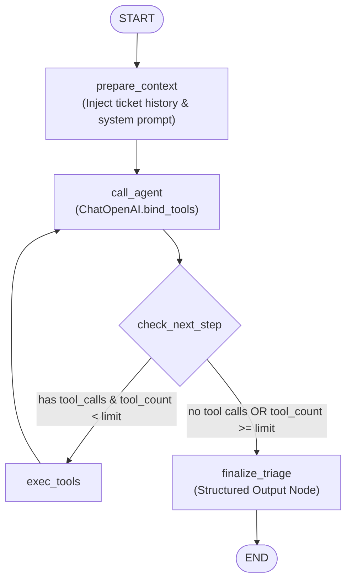

# System Design: Support Ticket Triage Agent

## 1. Overview & Tech Stack

AI Support Ticket Triage Agent designed to classify incoming support tickets, evaluate urgency, retrieve relevant internal documentation/customer profiles, and determine deterministic operational next actions for the OOCA AI Engineer test.

| Component | Tech Stack | Rationale |
| :--- | :--- | :--- |
| **Language** | Python 3.11+ | Standard, comprehensive type annotations (`typing`, `Literal`). |
| **Agent Framework** | **LangGraph** | Cyclic state machine orchestrating bounded tool-calling loops and explicit conditional branching. |
| **LLM Engine** | OpenAI `gpt-4o` / `gpt-4o-mini` | Robust native tool calling and strict Pydantic structured outputs (`with_structured_output`). |
| **Data Validation** | Pydantic v2 | High-performance schema validation, serialization, and input/output contracts. |
| **CLI Interface** | Terminal CLI (`Rich`) | Clean, interactive evaluator experience with formatted diagnostic tables and decision logs. |
| **Testing** | Pytest | Automated verification of routing logic, mock tools, and safety guardrails. |

---

## 2. Graph Architecture

The workflow follows a standard cyclic LangGraph pattern (bounded tool execution loop + final structured extraction):



### Node Responsibilities:
1. **`prepare_context`**: Normalizes chronological multi-turn ticket threads, masks sensitive PII (credit cards/auth tokens), and initializes state with the system prompt.
2. **`call_agent`**: Evaluates whether auxiliary tools are needed using `ChatOpenAI.bind_tools`.
3. **`check_next_step` (Conditional Edge)**:
   - If `tool_calls` present and `tool_count < limit` (e.g., max 3) $\rightarrow$ routes to **`exec_tools`**.
   - If no `tool_calls` or tool limit reached $\rightarrow$ routes to **`finalize_triage`**.
4. **`exec_tools`**: Executes requested tools dynamically (`lookup_knowledge_base`, `check_customer_history`), appends tool output messages to the state, and loops back to `call_agent`.
5. **`finalize_triage`**: Calls the LLM via `.with_structured_output(TriageDecision)` to synthesize diagnostic findings, enforce business guardrails, and generate the final structured decision.

---

## 3. Data Schema & Contracts

### 3.1 State Schema (`TriageState`)
```python
from typing import Annotated, Any, Dict, List, Optional
from typing_extensions import TypedDict
from langchain_core.messages import BaseMessage
from langgraph.graph.message import add_messages

class TriageState(TypedDict):
    ticket_id: str
    customer_info: Dict[str, Any]
    messages: Annotated[List[BaseMessage], add_messages]
    tool_call_count: int
    triage_result: Optional[Dict[str, Any]]
```

### 3.2 Output Schema (`TriageDecision`)
```python
from enum import Enum
from typing import Optional
from pydantic import BaseModel, Field

class UrgencyLevel(str, Enum):
    CRITICAL = "critical"
    HIGH = "high"
    MEDIUM = "medium"
    LOW = "low"

class NextAction(str, Enum):
    AUTO_RESPOND = "auto-respond"
    ROUTE_TO_SPECIALIST = "route_to_specialist"
    ESCALATE_TO_HUMAN = "escalate_to_human"

class TriageDecision(BaseModel):
    urgency: UrgencyLevel = Field(..., description="critical, high, medium, or low")
    product: str = Field(..., description="Specific product or feature module involved")
    issue_type: str = Field(..., description="Issue category: billing, outage, bug, feature_request, etc.")
    customer_sentiment: str = Field(..., description="Customer emotional state across the thread")
    next_action: NextAction = Field(..., description="auto-respond, route_to_specialist, or escalate_to_human")
    routing_target: Optional[str] = Field(None, description="Target team (e.g., Billing Operations, On-Call DevOps)")
    reasoning: str = Field(..., description="Internal diagnostic justification")
    draft_response: Optional[str] = Field(None, description="Customer-facing draft acknowledgment or answer")
```

---

## 4. Tools (Mock Backend)

1. **`lookup_knowledge_base(query: str)`**:
   - Searches mock FAQ/Doc articles:
     - Duplicate charge policies: temporary bank authorization holds vs. settled charges and refund SLAs.
     - HTTP 500 incident protocols: status dashboard reporting delays during localized CDN/edge failures.
     - macOS dark mode system syncing limitations and feature request backlog.
2. **`check_system_status(region: Optional[str] = None)`**:
   - Queries telemetry and infrastructure health metrics for specified regions (e.g., `Asia / Thailand`, `US-East`). Reports synthetic monitor status and edge latency.

---

## 5. Key Business Logic & Guardrails

1. **Zero Financial Commitment Policy:**
   - Under billing dispute scenarios, the agent **must never autonomously authorize or promise refunds** in `draft_response`. It clarifies bank temporary holds and routes the ticket to `Billing Operations`.
2. **Enterprise Outage Overrides Dashboard Status:**
   - Multi-user, multi-browser HTTP 500 reports from Enterprise clients supersede "all systems green" status pages, triggering immediate Sev-1 escalation (`critical` $\rightarrow$ `escalate_to_human`).
3. **Cross-Lingual Mirroring:**
   - Tickets submitted in Thai (Scenario 2) receive polite, formal Thai responses with appropriate particles (`ครับ/ค่ะ`).
4. **Loop Protection:**
   - Caps tool calls at 3 to prevent infinite tool-calling loops and API cost runaway.

---

## 6. Project Structure

```text
support-triage-agent/
├── .env.example                  # OPENAI_API_KEY template
├── requirements.txt              # Production & dev dependencies
├── README.md                     # Setup, environment, & run instructions
├── writeup.md                    # 1-page design write-up for homework submission
├── data/
│   ├── sample_tickets.json       # Canonical 3 test scenarios (12 messages) from prompt
│   └── kb/                       # Internal Markdown documentation corpus
│       ├── billing_refund_policy.md
│       ├── incident_sev1_runbook.md
│       ├── macos_desktop_known_issues.md
│       └── account_security_faq.md
├── src/
│   ├── __init__.py
│   ├── config.py                 # App settings, OpenAI model constants, thresholds
│   ├── models/
│   │   ├── __init__.py
│   │   ├── domain.py             # Input data contracts (Ticket, Customer, Message)
│   │   └── triage.py             # Output schemas (TriageResult, Classifications)
│   ├── state.py                  # LangGraph AgentState TypedDict definition
│   ├── tools/
│   │   ├── __init__.py
│   │   ├── base.py               # Shared tool registries & decorators
│   │   ├── system_tools.py       # check_system_status tool
│   │   └── knowledge_tools.py    # lookup_knowledge_base tool
│   ├── prompts/
│   │   ├── __init__.py
│   │   ├── system_prompt.py      # Core agent instructions, SLA logic, guardrails
│   │   └── extraction_prompt.py  # Structured finalization prompts
│   ├── graph/
│   │   ├── __init__.py
│   │   ├── nodes.py              # LangGraph node implementations
│   │   ├── edges.py              # Conditional routing logic
│   │   └── workflow.py           # Compiled StateGraph definition
│   └── utils/
│       ├── formatting.py         # Terminal CLI styling (rich / tabulate)
│       └── pii_sanitizer.py      # PII scrubbing (Credit cards, emails)
└── main.py                       # CLI execution entrypoint
```
